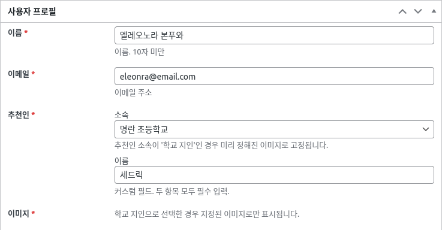
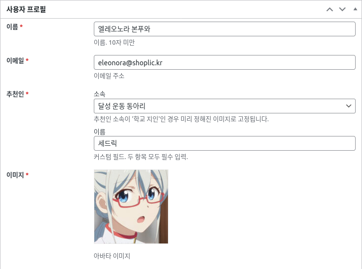

# 명란 플러그인

meta-box 플러그인 사용법 연습 플러그인

## 구현 내용 설명

[Meta Box](https://wordpress.org/plugins/meta-box/) 플러그인을 사용합니다.
이 플러그인은 무료입니다.

회원의 커스텀 필드를 관리자 페이지에서 입력받습니다. 회원의 간단한 프로필 정보를 편집하는
메타 박스 인터페이스를 Meta Box 플러그인을 사용하여 구현합니다.

메타 박스는 유료 플러그인 중 진짜 워드프레스 회원의 메타 정보를 편집할 수 있도록 도와주는
확장이 존재하지만, 유료입니다. 그리고 기본적인 사용 방법은 흡사하므로 여기서는 커스텀 포스트를 
마치 회원 정보인 것으로 가정하고 진행하겠습니다.

커스텀 포스트에서 취급하는 커스텀 필드는 아래 목록과 같습니다.
- 이름: 텍스트. 10자 미만. 필수.
- 이메일: 이메일. 필수.
- 추천인: 텍스트. 커스텀 UI 형태를 요구함. 모두 필수.
- 프로필 이미지: 미디어 첨부 이미지. 조건부 필수.

추천인 필드는 커스텀 UI로 구성합니다. 이 필드는 아래 조건을 요구합니다.
1. 추천인의 소속을 입력해야 합니다.
   * 추천인은 '학교 지인', '동아리', 두 개의 소속으로 나뉘어 있습니다.
   * 각 소속별로 세부 소속이 열거됩니다. 아래는 소속 예시입니다.
     * 학교 지인
       * 명란 초등학교
       * 명란 중학교
     * 동아리 지인
       * 달성 운동 동아리
       * 서초 컴퓨터 동아리
2. 추천인의 이름을 입력해야 합니다. 텍스트 입력입니다.
3. 소속과 이름은 모두 필수입니다.
4. 소속이 '학교 지인'인 경우 프로필 이미니 필드에 영향을 줍니다.
   * 소속이 '학교 지인'인 경우, 관리자가 미리 지정한 이미지로 대체됩니다.
     * 이 경우 원래는 관리자가 지정된 이미지를 보여 주게 되었습니다.
     * 플러그인의 구현 사이즈상 지정된 이미지 설정 가능, 보여주는 기능은 생략했습니다.
     * 이것을 선택한 경우, 프로필 이미지는 업로드 하지 않아도 됩니다(설사 했더라도 무시됩니다).
   * 소속이 '학교 지인'이 아닌 경우, 사용자가 자유롭게 이미지를 업로드 할수 있습니다.
     * 이것을 선택한 경우, 프로필 이미지는 반드시 업로드 해야 합니다.

완성된 화면은 아래와 같습니다.

### 완성된 화면 1 - 학교 지인 선택

### 완성된 화면 2 - 학교 지인외 선택

